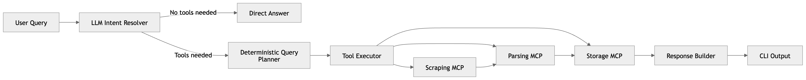

# PriceMind AI  
**A modular, LLM-assisted, tool-driven system for collecting, structuring, and analyzing LLM pricing data**

## Overview

PriceMind AI is a modular AI system designed to **collect, structure, store, and analyze LLM pricing data** from multiple providers.

Unlike fully agentic systems, PriceMind follows a **hybrid architecture**:

- LLM-driven intent resolution 
- Deterministic execution pipeline

This design ensures:
- flexibility in understanding user queries
- reliability and reproducibility in execution

## Key Idea
**The LLM decides what to do**
**The system decides how to do it safely**

All orchestrated through a **multi-step tool pipeline using MCP (Model Context Protocol)**.


## Architecture engineering



## Core Components
### Orchestrator (Agent Layer)

- LLM-driven **intent resolution**
- Determines whether tools are needed
  - Extracts:
  - intent type
  - providers
  - model name
- Delegates execution to deterministic pipeline

### MCP (Model Context Protocol)
- Exposes Python functions as tools
- Enables modular system composition
- Decouples scraping, parsing, storage

#### Scraping MCP
- Uses Firecrawl
- Extracts: raw HTML + Markdown
- Persists metadata (timestamp, source, files)

#### Parsing MCP
Hybrid extraction strategy:
- Deterministic-first extraction
  - Markdown tables
  - Inline pricing patterns
- LLM fallback (OpenAI) when parsing fails
- Validation via Pydantic models
- Deduplication of extracted records

#### Storage MCP
- SQLite-based persistence
- Normalized schema:
  - providers
  - models (canonicalized)
  - pricing records
  
Supports:
- latest prices
- provider comparison
- historical inserts

#### Analytics MCP 
- Computes summaries (cheapest provider, etc.)
- Optional layer for future extensions

## Workflow
1. The user submits a query  
2. Router extracts:
   - tools needed?
   - intent
   - providers
   - model name  
3. Planner builds execution steps
4. Executor runs tools sequentially:
   - scrape → raw content
   - parse → structured records
   - store → database
   - compare → result
5. ResponseBuilder formats output

#### Input example 
```bash
compare groq and fireworks for llama 3.3 70b
```

#### Output example 
```bash
Price comparison

Provider | Model         | Input / 1M | Output / 1M | Currency
---------+---------------+------------+-------------+---------
groq     | llama 3.3 70b | 0.5900     | 0.7900      | USD
fireworks| llama 3.3 70b | 0.6100     | 0.8200      | USD

Cheapest input: groq
Cheapest output: groq
```

## Key Features
- LLM-assisted decision making (tool vs no tool)
- Deterministic + LLM hybrid pipeline
- Provider-isolated execution context
- Hybrid parsing (rules + LLM fallback)
- Strong validation (Pydantic)
- Currency normalization
- Flexible model matching
- Clean CLI output (no raw HTML noise)
- End-to-end pipeline (scrape → parse → store → query)
- Fully testable (unit + integration + e2e)

## Tech Stack

- Python 3.11+
- OpenAI API (LLM fallback)
- MCP (Model Context Protocol)
- Firecrawl (scraping)
- SQLite
- Pydantic
- Pytest

## Getting Started

### Clone the repository
```bash
git clone https://github.com/your-username/pricemind-ai.git
cd pricemind-ai
```

### Install dependencies
```bash
python -m venv .venv
source .venv/bin/activate
pip install -e ".[dev]"
```

### Set environment variables
```bash
OPENAI_API_KEY=your_api_key
MODEL_NAME=gpt-4o-mini
FIRECRAWL_API_KEY=your_firecrawl_key
```
## Run

### Bootstrap the database:
```bash
python -m scripts.bootstrap_db
```

### Run the orchestrator:
```bash
python -m apps.orchestrator.main
```
### Example commands:
```bash
show data
price of llama 3.3 70b on groq
compare groq and fireworks for llama 3.3 70b
refresh groq
```

### Quick Validation
```bash
python -m scripts.bootstrap_db && pytest
```

## Testing Strategy
```bash
pytest
pytest -m unit
pytest -m integration
pytest -m e2e
```

## Current Limitations
- Parsing still imperfect on complex layouts
- Model normalization not fully semantic (no embeddings yet)
- No true UPSERT → duplicates possible
- No snapshot/versioning of data
- SQLite not production-ready
- LLM fallback still heuristic-based

## Future Improvements
- True UPSERT with conflict resolution
- Snapshot-based data versioning
- Advanced model normalization (aliases, fuzzy match)
- HTML-aware parsing (DOM-based extraction)
- Retry & caching layer for scraping
- Observability (logs, metrics)
- PostgreSQL migration
- API layer (FastAPI)
- RAG for historical pricing


## Why This Project Matters
PriceMind demonstrates how to build a **production-grade AI system** where:
- LLMs are **used intelligently, not blindly**
- deterministic systems ensure **reliability**
- modular tools enable **scalability**

It is a blueprint for:
**Hybrid AI systems combining reasoning + engineering rigor**
